<p align="center">
  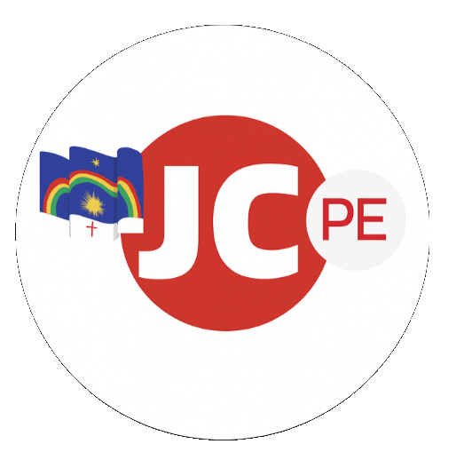
</p>


# 📰 JC Online – Aplicação Web

**JC Online** é uma aplicação web com design adaptável, focada em melhorar a experiência de leitura de notícias.

O objetivo é oferecer **acessibilidade, personalização e engajamento** dos usuários, ao mesmo tempo em que garante ferramentas de gestão para administradores e editores.

🔗 **Acesse a plataforma online:**  
👉 https://rafaeldev.pythonanywhere.com/


## 📄 Documentações e Entregas

<div style="display: flex; align-items: center; gap: 10px; flex-wrap: wrap;">
  <a href="https://docs.google.com/document/d/1nmucgv21ZFmh4KJL6easKM9BG2wHbv332d-kuiChz2I/edit?usp=sharing">
    </a>
  <a href="https://www.figma.com/board/mfDODhZAbZBivMjCYXKV4Q/Projetos-2-Time-2?node-id=0-1&t=4ilAjPXIL59rE93n-1">
    </a>
  <a href="https://tinyurl.com/site-equipe2projetos2">
    </a>
  <a href="https://tinyurl.com/drive-equipe2projetos2">
    </a>
  <a href="https://time2projetos2.atlassian.net/jira/software/projects/SCRUM/boards/1?atlOrigin=eyJpIjoiZGI1ZmI2MzY3NmQyNDgwZGFjYzE1MTdjYzdlNDMxYjAiLCJwIjoiaiJ9">
    </a>
  <a href="https://trello.com/b/FPQBhOen/equipe-2-desafio-jc-online">
    </a>
  <a href="https://rafaeldev.pythonanywhere.com/">
    
</a>
  <a href="https://youtu.be/IrzoyKmpHWQ?feature=shared">
    </a>
  <a href="https://youtu.be/QxsYSBjsHtM?si=z3-S6Z1V2LBfqq0V">
    </a>
  
</div>


## 🚀 Funcionalidades 

#### Gestão de Usuários
- **Cadastro e Login:** Sistema completo para cadastro e login de usuários, incluindo perfis de acesso.

#### Interatividade e Engajamento
- **Comentários:** Permite que os leitores comentem nas notícias.
- **Curtidas:** Funcionalidade para curtir notícias.
- **Notificações por E-mail:** Opção para receber notícias rápidas por e-mail.

#### Personalização 
- **Personalização de Feed:** Ferramentas para que o usuário possa customizar o feed de notícias.

#### Acessibilidade
- **Modo Claro/Escuro:** Alternância entre temas para maior conforto visual.
- **Ajustes de Contraste e Fonte:** Controles para ajustar o contraste e o tamanho da fonte, garantindo a legibilidade.

### 📈 Diferenciais
- Experiência mobile otimizada.
- Conteúdo acessível.

## 🛠️ Tecnologias Utilizadas
- **Frontend**: 
- **Backend**:   
- **Banco de Dados**: 
- **Acessibilidade**:
- **Testes**: 

---

## 👥 Nossa Equipe

| Nome                                      | Funções | Email                              | Disciplina         |
|-------------------------------------------|---------|------------------------------------|--------------------|
| Claudemir Adriano de Albuquerque Silva    | Dev Backend | [caas@cesar.school](mailto:caas@cesar.school) | Projetos 2 + FDS |
| Fábio                                     | Dev Backend | [fhdlla@cesar.school](mailto:fhdlla@cesar.school) | Projetos 2 + FDS |
| Felipe Borba De Carvalho                  | Dev Frontend + Designer | [fbc2@cesar.school](mailto:fbc2@cesar.school) | Projetos 2 + FDS |
| Francisco Rodrigues de Oliveira Junior    | PO (Product Owner)| [froj@cesar.school](mailto:froj@cesar.school) | Projetos 2 + FDS |
| Lucas Chaves                              | Scrum Master | [lca3@cesar.school](mailto:lca3@cesar.school) | Projetos 2 + FDS |
| Pedro Gabriel Paes da Justa Silva         | Dev Frontend + Designer | [pgpjs@cesar.school](mailto:pgpjs@cesar.school) | Projetos 2 + FDS |
| Rafael Lyra Costa                         | DEV Backend + DevOps | [rlc3@cesar.school](mailto:rlc3@cesar.school) | FDS              |

---

## ⚙️ Como Executar o Projeto

<details>
  <summary>✅ Primeira vez no projeto (setup inicial)</summary>
  

## Siga os passos abaixo para executar o projeto em sua máquina.

### Pré-requisitos

Antes de começar, certifique-se de que você tem o seguinte instalado:
* [Python 3.8+](https://www.python.org/downloads/)
* [Git](https://git-scm.com/downloads/)
* (Opcional) [VS Code](https://code.visualstudio.com/) — recomendado para editar e executar o projeto.

#### Extensões úteis no VS Code:
- **Python** (by Microsoft)
- **Django**

---

### Passos para Execução

1.  **Clone o repositório:**
    ```bash
    git clone https://github.com/[SEU-USUARIO]/jc-projetos2.git
    cd jc-projetos2
    ```
    > **Obs:** Substitua `[SEU-USUARIO]` pelo seu nome de usuário do GitHub.

---

2.  **Crie e ative o ambiente virtual:**
    *Este passo cria um ambiente isolado para as dependências do projeto.*
    ```bash
    # Criar o ambiente
    python -m venv venv
    ```

    *Agora, ative o ambiente:*
    ```bash
    # No Windows (PowerShell):
    .\venv\Scripts\Activate
    ```

    > ⚠️ Caso apareça um erro dizendo que a execução de scripts está bloqueada, execute o comando abaixo antes de ativar:
    ```bash
    Set-ExecutionPolicy Unrestricted -Scope Process
    ```

    ```bash
    # No Linux ou macOS:
    source venv/bin/activate
    ```

---

3.  **Instale as dependências:**
    ```bash
    pip install -r requirements.txt
    ```

---

4.  **Execute as migrações do banco de dados:**
    ```bash
    python manage.py migrate
    ```

---

5.  **Crie um superusuário (opcional):**
    *Permite o acesso à área administrativa do Django.*
    ```bash
    python manage.py createsuperuser
    ```

---

6.  **Inicie o servidor de desenvolvimento:**
    ```bash
    python manage.py runserver
    ```

---

7.  **Acesse a aplicação no seu navegador:**
    - **Interface Principal:** [http://127.0.0.1:8000/](http://127.0.0.1:8000/)
    - **Área Administrativa:** [http://127.0.0.1:8000/admin/](http://127.0.0.1:8000/admin/)

---

🎉 **Pronto!** A aplicação estará rodando em sua máquina local.
</details>

<details>
  <summary>🔁 Workflow Diário (Antes de Começar a Codificar)</summary>
  <br>
  
  Siga estes passos todos os dias para garantir que seu ambiente está atualizado.

  1.  **Ative o ambiente virtual (`venv`)**
      * **Windows (PowerShell):**
          ```powershell
          .\venv\Scripts\Activate
          ```
      * **Linux/Mac:**
          ```bash
          source venv/bin/activate
          ```

  2.  **Sincronize com o repositório remoto**
      *Para baixar as atualizações feitas por outros desenvolvedores.*
      ```bash
      git pull origin main
      ```

  3.  **Atualize as dependências**
      *Faça isso se o arquivo `requirements.txt` foi modificado no passo anterior.*
      ```bash
      pip install -r requirements.txt
      ```

  4.  **Aplique migrações do banco de dados**
      *Necessário se a estrutura do banco de dados (`models.py`) foi alterada.*
      ```bash
      python manage.py migrate
      ```

  5.  **Inicie o servidor local**
      ```bash
      python manage.py runserver
      ```
</details>

<details>
  <summary>🔄 Esqueceu de dar `pull` antes de codificar?</summary>
  <br>
  
  Se você tem alterações locais e o `git pull` falha, não se preocupe! 🚨. Use o `stash` para salvar seu trabalho temporariamente.

  1.  **Guarde suas alterações locais:**
      *Isso "limpa" sua área de trabalho, mas salva seu código em um local seguro.*
      ```bash
      git stash
      ```

  2.  **Atualize o repositório:**
      *Agora que sua área está limpa, você pode puxar as atualizações sem conflitos.*
      ```bash
      git pull origin main
      ```

  3.  **Restaure suas alterações:**
      *Isso aplica suas alterações salvas sobre o código que você acabou de baixar.*
      ```bash
      git stash pop
      ```
      > **Dica:** Se ocorrerem conflitos aqui, o Git irá te avisar para resolvê-los manualmente.
</details>

<details>
  <summary>🧱 Guia: Alterando os Models</summary>
  <br>
  
  Quando você modificar qualquer arquivo `models.py`, siga esta ordem:

  1.  **Gere os arquivos de migração:**
      ```bash
      python manage.py makemigrations
      ```

  2.  **Aplique as alterações no seu banco de dados local:**
      ```bash
      python manage.py migrate
      ```

  3.  **Suba as mudanças para o repositório:**
      ```bash
      git add .
      git commit -m "feat: altera models de X (gera migração)"
      git push origin main
      ```
</details>

<details>
  <summary>📦 Guia: Adicionando uma Nova Biblioteca</summary>
  <br>
  
  Ao instalar um novo pacote com `pip`, não se esqueça de atualizar o `requirements.txt`.

  1.  **Instale a biblioteca no seu venv:**
      ```bash
      pip install nome-da-biblioteca
      ```

  2.  **Atualize ("congele") o `requirements.txt`:**
      *Este comando salva a lista de todas as bibliotecas e suas versões exatas.*
      ```bash
      pip freeze > requirements.txt
      ```

  3.  **Suba o `requirements.txt` atualizado:**
      ```bash
      git add requirements.txt
      git commit -m "chore: adiciona a biblioteca nome-da-biblioteca"
      git push origin main
      ```
</details>

---

## 📦 Entregas

### Projetos 2

<details>
<summary>🚀 SR1 (entrega 1)</summary>
  <br/>
  
  [Visualizar Status Report 1](./prints/Status-Report-1.pdf)

</details>

 <details>
<summary>🚀 SR2 (entrega 2)</summary>
  <br/>
 </details>

### FDS 

<details> 
<summary>🚀 Entrega 1</summary>
<br/>

### 📄 Quadro Jira

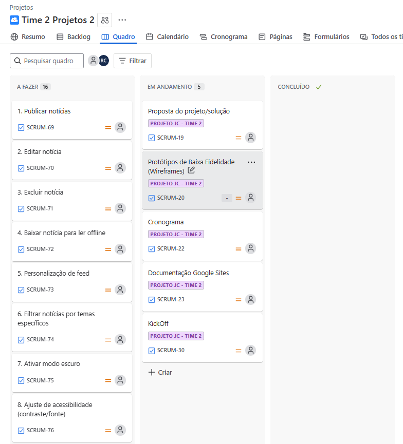

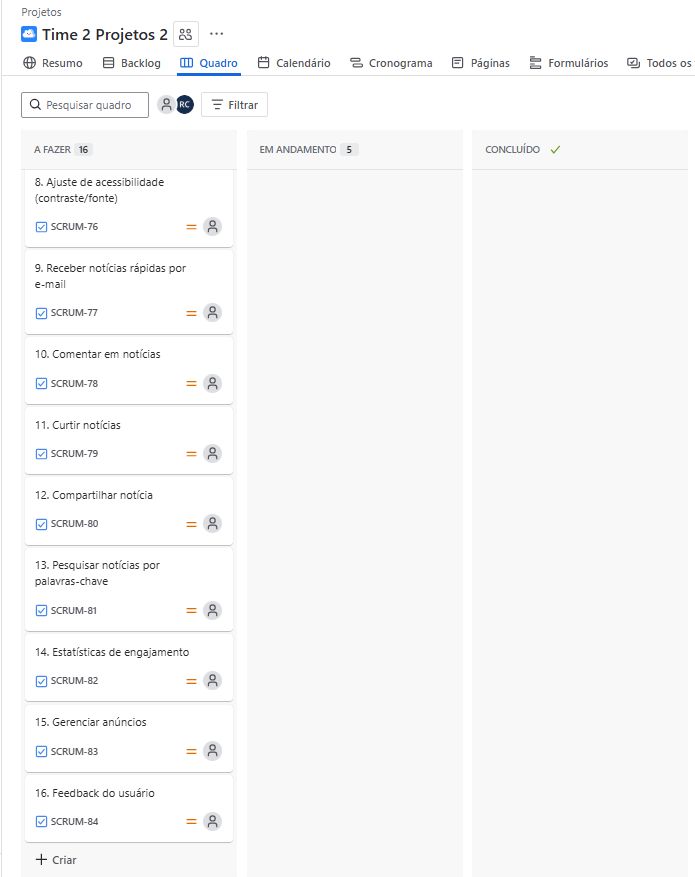


---

### 📄 Jira Backlog

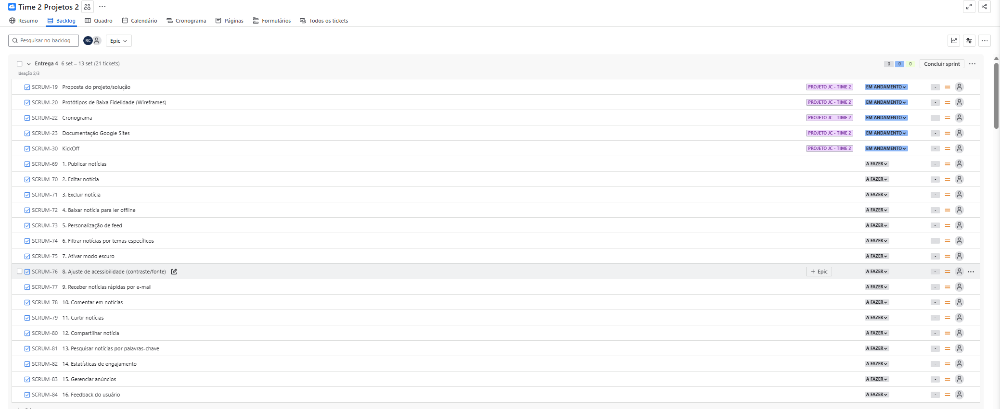

---

### 👥 Funções
| Nome                                   | Função                     |
|----------------------------------------|-----------------------------|
| Claudemir Adriano de Albuquerque Silva | Dev Backend                |
| Fábio                                  | Dev Backend                |
| Felipe Borba De Carvalho               | Dev Frontend + Designer    |
| Francisco Rodrigues de Oliveira Junior | PO (Product Owner)         |
| Lucas Chaves                           | Scrum Master               |
| Pedro Gabriel Paes da Justa Silva      | Dev Frontend + Designer    |
| Rafael Lyra Costa                      | Dev Backend +  DevOps      |

---

### 📄 Links da entrega

<p align="center">
  <a href="https://docs.google.com/document/d/1nmucgv21ZFmh4KJL6easKM9BG2wHbv332d-kuiChz2I/edit?usp=sharing">
    </a> 
  <a href="https://time2projetos2.atlassian.net/jira/software/projects/SCRUM/boards/1?atlOrigin=eyJpIjoiZGI1ZmI2MzY3NmQyNDgwZGFjYzE1MTdjYzdlNDMxYjAiLCJwIjoiaiJ9">
    </a>
</p>
<br/>
  
</details>

<details>
  <summary>🚀 Entrega 2</summary>
  <br/>

  ### 📄 Links da entrega

<p align="center">
  <a href="https://docs.google.com/document/d/1nmucgv21ZFmh4KJL6easKM9BG2wHbv332d-kuiChz2I/edit?usp=sharing">
    </a> 
  <a href="https://time2projetos2.atlassian.net/jira/software/projects/SCRUM/boards/1?atlOrigin=eyJpIjoiZGI1ZmI2MzY3NmQyNDgwZGFjYzE1MTdjYzdlNDMxYjAiLCJwIjoiaiJ9">
    </a>
  <a href="https://www.figma.com/design/3VrvmwIAN8WB01nf0a7Zyz/Untitled?node-id=0-1&t=L9QFYe6fDEtr1nbI-1">
    </a>
  <a href="https://youtu.be/IrzoyKmpHWQ?feature=shared">
    </a>
  <a href="https://www.canva.com/design/DAGzjAnYGoQ/pjgqU4m0RzsDCLpylTslIg/edit?utm_content=DAGzjAnYGoQ&utm_campaign=designshare&utm_medium=link2&utm_source=sharebutton">
    </a>
</p>

## Quadro Jira

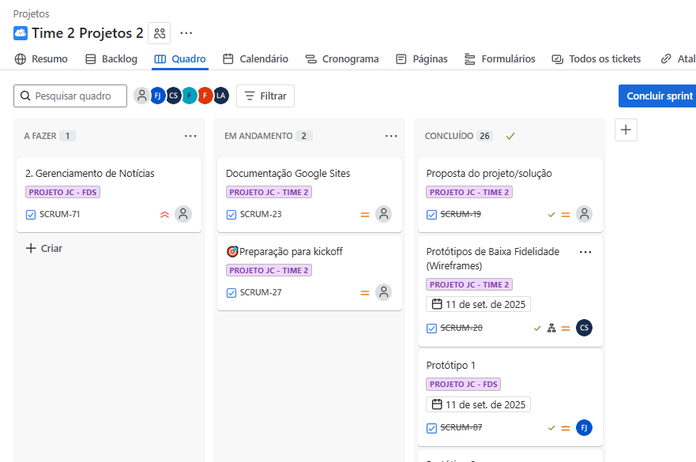  

---

## Jira Backlog
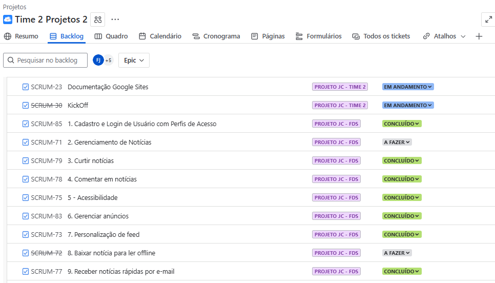  

---

 ## Diagrama de atividades do Sistema
  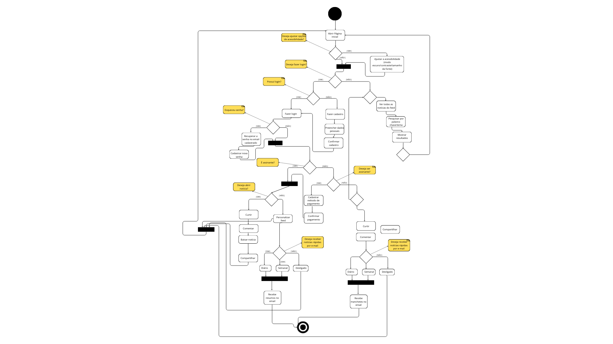

---

## Figma

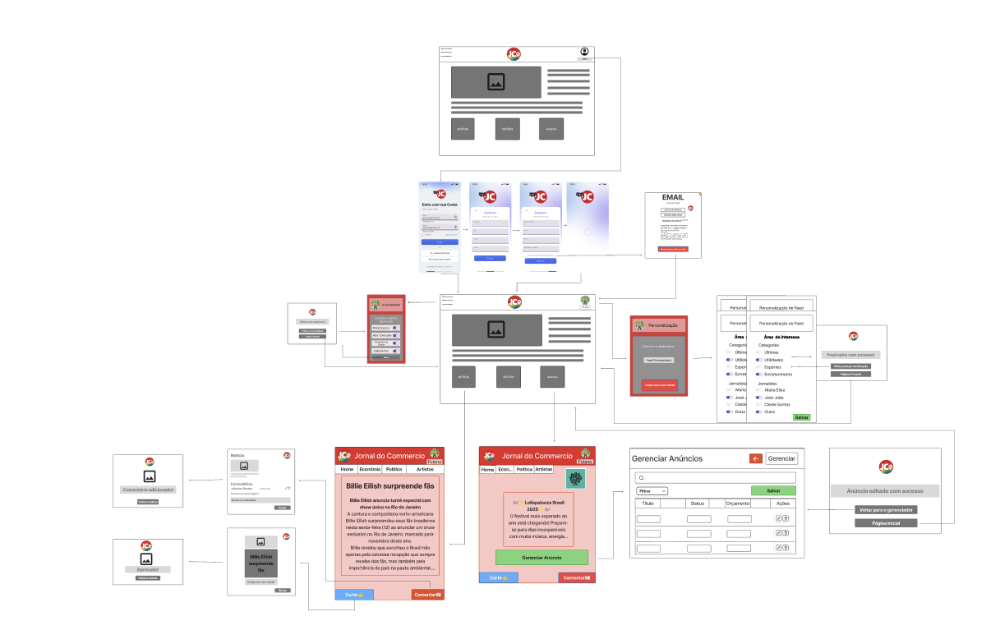

---

## Issues

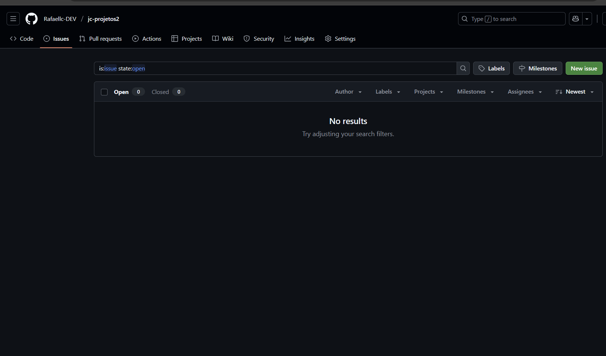

- Utilizado para acompanhar todos os problemas e novas ideias que surgirem durante o desenvolvimento.

- Cada tarefa registrada precisa informar: o que fazer (descrição), como encontrar o problema (passos para reproduzir), quem vai fazer (responsável), qual a urgência (prioridade) e em que etapa está (status).

- Plataformas que podem ser usadas para isso: GitHub Issues, Jira, Trello.

  <br/>
</details>

<details>
  <summary>🚀 Entrega 3</summary>
  <br/>

<p align="center">
  <a href="https://trello.com/b/FPQBhOen/equipe-2-desafio-jc-online">
    </a>
  <a href="https://www.canva.com/design/DAGzjAnYGoQ/pjgqU4m0RzsDCLpylTslIg/edit?utm_content=DAGzjAnYGoQ&utm_campaign=designshare&utm_medium=link2&utm_source=sharebutton">
    </a>
  <a href="https://rafaeldev.pythonanywhere.com/">
    </a>
  <a href="https://youtu.be/jtHMVjp_xo8">
    </a>
</p>

---

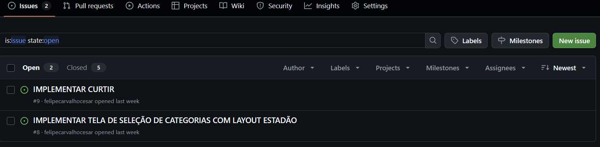

---


---

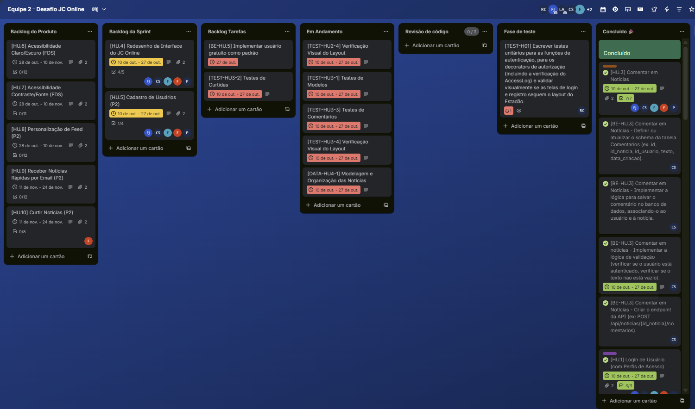

---

## Programação em Par

---

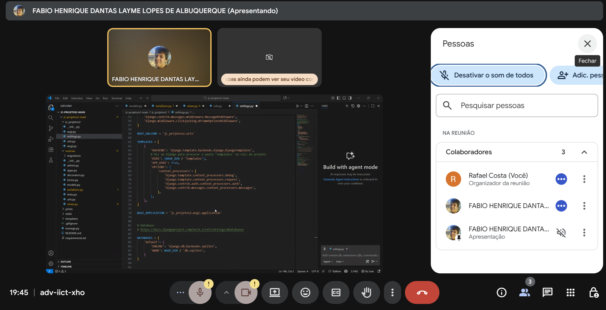

---
Utilizamos a programação em par, e aqui está um relaório de uma delas:

Fábio e Rafael realizaram uma sessão de programação em par.
O objetivo foi corrigir o Bug #6, que afetava o cadastro de novos usuários.
Com o trabalho conjunto, conseguiram resolver a falha com sucesso.

  

</details>

<details>
  <summary>🚀 Entrega 4</summary>
  <br/>

<p align="center">
  <a href="https://trello.com/b/FPQBhOen/equipe-2-desafio-jc-online">
    </a>
  <a href="https://www.figma.com/design/3VrvmwIAN8WB01nf0a7Zyz/Untitled?node-id=0-1&t=L9QFYe6fDEtr1nbI-1">
    </a>
  <a href="https://rafaeldev.pythonanywhere.com/">
    </a>
  <a href="https://youtu.be/1QAYvRLuBTw">
    </a>
  <a href="https://youtu.be/_GIRnmcdp_g">
    </a>
</p>

---

## Issues

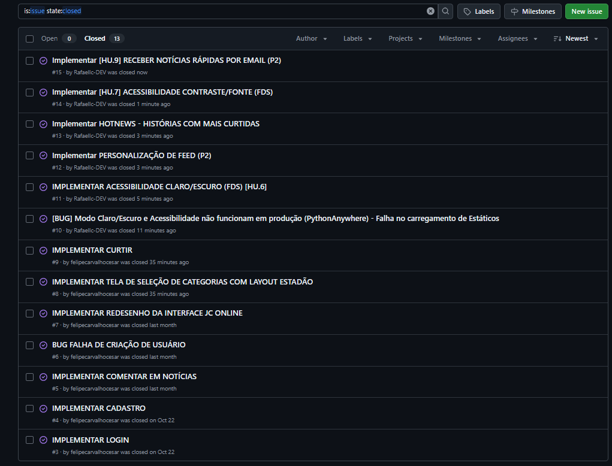

---

## Quadro

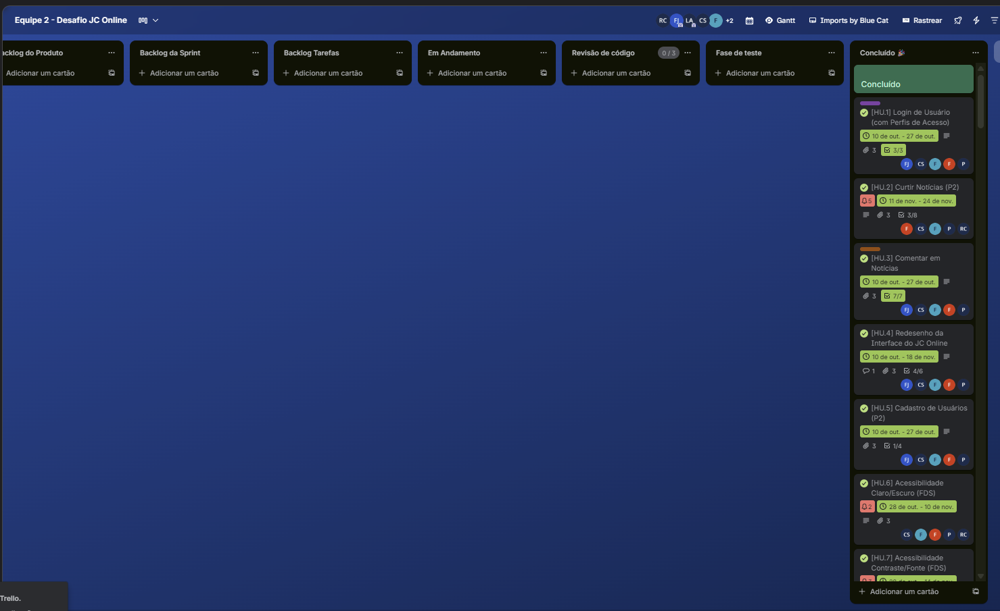

---
## Figma


## Programação em Par

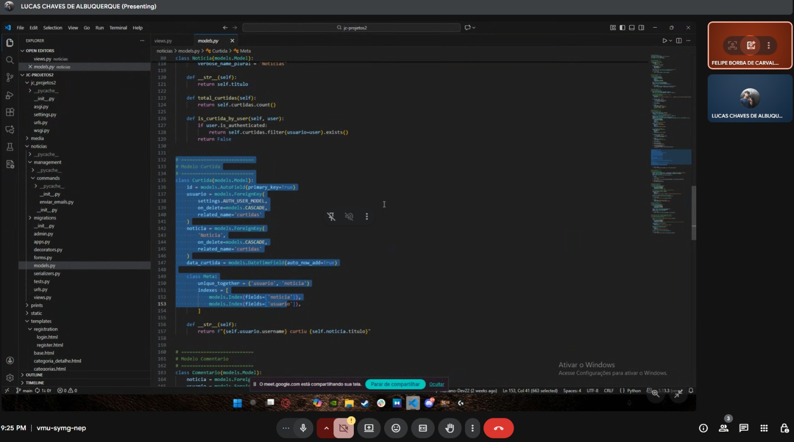

A sessão anterior de programação em par, conduzida por Fábio e Rafael, resultou na correção bem-sucedida do Bug #6 que afetava o cadastro de novos usuários.

Em um novo ciclo de trabalho, Lucas e Felipe assumiram a frente. Logo após a correção do Bug #6, eles identificaram o Bug #7, que se manifestava como uma falha na contagem de curtidas. A equipe concluiu que se tratava de uma regressão, causada pela alteração de uma variável de estado compartilhada durante a correção anterior.

Utilizando novamente a programação em par, Lucas e Felipe conseguiram isolar rapidamente a causa e resolver o novo problema, garantindo a estabilidade das funcionalidades de Cadastro e Curtida


---

## 📘 Guia de Contribuição

Para aprender como configurar o ambiente e contribuir com o projeto, consulte o arquivo:

👉 [CONTRIBUTING.md](CONTRIBUTING.md)

</details>

---

## 💡 Observações

> Projeto desenvolvido na disciplina de **Projetos 2** e **FDS (Fundamentos de Desenvolvimento de Software) – 2025.2** na CESAR School.
